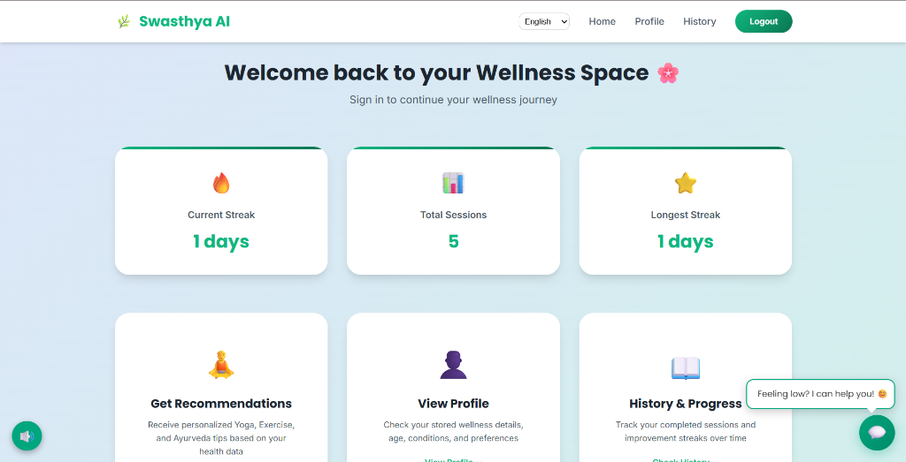
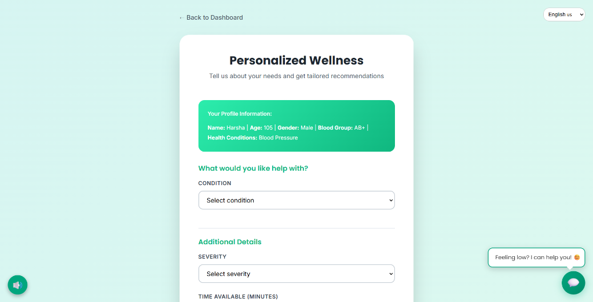
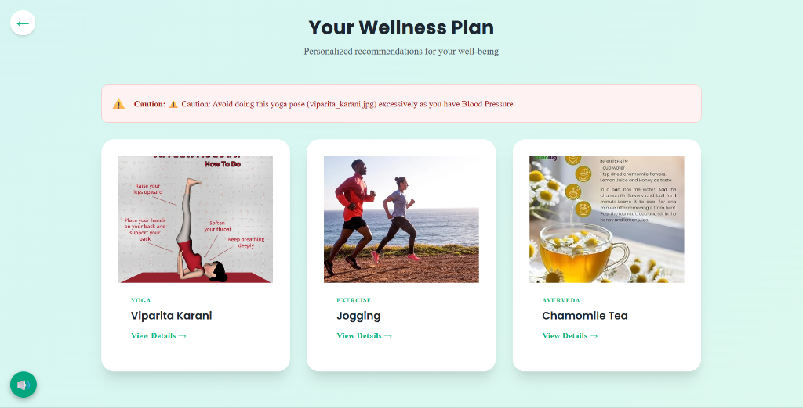
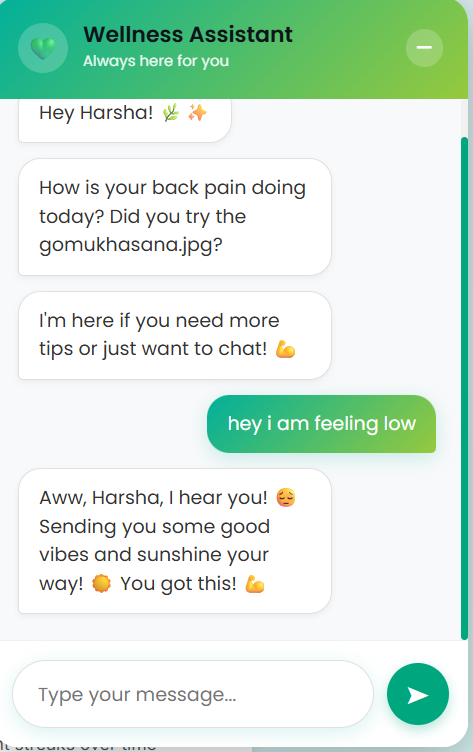

# 🌿 Swasthya AI - Holistic Wellness Companion


## 📖 Description

**Swasthya AI** is an intelligent, AI-powered wellness application designed to bridge the gap between modern hectic lifestyles and holistic health practices. It acts as your personal wellness coach, understanding your unique physiological profile—age, gender, BMI, and specific health conditions—to curate safe and effective wellness plans.

Unlike generic fitness apps that offer "one-size-fits-all" workouts, Swasthya AI uses **Machine Learning** and **Generative AI** to ensure that every Yoga pose, Exercise, and Ayurvedic tip is compatible with your health needs. Whether you are managing **Diabetes**, controlling **Hypertension**, or simply seeking stress relief, Swasthya AI adapts to you.

---

## 📑 Table of Contents

- [Features](#-features)
- [Real-World Use Cases](#-real-world-use-cases)
- [Technology Stack](#-technology-stack)
- [Installation](#-installation)
- [Usage](#-usage)
- [Project Structure](#-project-structure)
- [Contributing](#-contributing)
- [License](#-license)

---

## ✨ Features

### 🧠 Dual-Core AI Engine
- **Generative Intelligence**: Powered by **Google Gemini 2.5 Flash** to provide explanatory content and dynamic wellness advice.
- **Predictive Safety**: Custom **Random Forest Classifiers** analyze your health metrics to predict safe intensity levels and filter out contraindicated poses (e.g., avoiding inversions for High BP patients).

### 🏥 Condition-Centric Design
- **Diabetes Management**: Recommends low-impact cardio and glucose-regulating yoga flows.
- **Heart Care (BP)**: Focuses on stress reduction and avoids exercises that spike blood pressure excessively.
- **Women's Health**: Specialized modules for **PCOD** management and **Post-Pregnancy** recovery.

### 🌐 Universal Accessibility
- **Multi-Language Support**: Instantly switch the entire interface between **English, Hindi, Telugu, and Kannada**.
- **Audio Guidance**: Built-in **Text-to-Speech (TTS)** reads out instructions for a hands-free experience during workouts.

### 📊 Gamified Progress
- **Streaks & Rewards**: Keeps you motivated by tracking daily consistency.
- **Analytics Dashboard**: Visualizes your health journey with interactive charts.
- **Session History**: Logs every workout for your review.

---

## � Real-World Use Cases

### 1. The Busy Professional 💼
*Scenario*: Has only 15 minutes before work, suffers from "text-neck" and high stress.
* **Swasthya's Solution**: Generates a quick, 15-minute "Office Yoga" routine focusing on neck stretches and breathing exercises (`Pranayama`) to reduce cortisol levels, without requiring a change of clothes.

### 2. The Senior Citizen 👴
*Scenario*: 65+ years old, dealing with arthritis and mild hypertension.
* **Swasthya's Solution**: Filters out high-impact jumping exercises. Suggests **Chair Yoga** and **Slow Walking**, along with Ayurvedic tips like *Turmeric Milk* for joint inflammation. The **Audio Guidance** helps them follow along without straining to read the screen.

### 3. The Expecting Mother 🤰
*Scenario*: Second trimester, looking for safe physical activity.
* **Swasthya's Solution**: strict filtering of unsafe core exercises. Recommends gentle **Prenatal Yoga** (`Baddha Konasana`) and easy stretching to improve circulation, flagged safe for pregnancy.

---

## � Screenshots

| **Landing Page** | **User Dashboard** |
|:---:|:---:|
|  |  |
| *Seamless onboarding experience* | *Your personal wellness command center* |

| **AI Recommendations** | **Personalized Plan** |
|:---:|:---:|
|  |  |
| *Tailored to your specific needs* | *Curated Yoga & Ayurveda routines* |

<div align="center">
  <h3>🤖 AI Wellness Companion</h3>
  
  <p><i>Empathetic, context-aware support whenever you need it.</i></p>
</div>

---

## �🛠 Technology Stack

### Frontend
- **HTML5 / CSS3**: Built with a responsive, glassmorphism-inspired design system.
- **JavaScript (ES6+)**: Handles client-side logic, API communication, and I18n (Internationalization).
- **Chart.js**: Renders dynamic health graphs and progress charts.

### Backend
- **Python & Flask**: Powers the REST Application Programming Interface (API).
- **Scikit-Learn**: Manages the Random Forest ML models for recommendation classification.
- **Google Gemini API**: Handles natural language generation for chatbot and dynamic content.

### Database
- **MongoDB Atlas**: Cloud-native NoSQL database storing User Profiles, Session Logs, and Authentication data.

---

## ⚙️ Installation

### Prerequisites
- Python 3.8+
- MongoDB Atlas Account
- Google Gemini API Key

### Step 1: Clone the Repository
```bash
git clone https://github.com/yourusername/swasthya-ai.git
cd swasthya-ai
```

### Step 2: Backend Setup
```bash
cd backend
pip install -r requirements.txt
# Configure your API keys in app.py
# MONGODB_URI = "..."
# GEMINI_API_KEY = "..."
python app.py
```

### Step 3: Frontend Launch
Simply open `frontend/index.html` in your preferred web browser. No build steps required!

---

## 🚀 Usage

1.  **Register**: Sign up using your email (OTP verification included).
2.  **Profile Setup**: Enter your Age, Gender, Height, Weight, and any medical conditions.
3.  **Get Recommendations**: Navigate to the "Recommendations" tab and request a plan based on your current mood and time availability.
4.  **Start Workout**: Follow the AI-curated list of Yoga, Exercise, and Ayurvedic tips.
5.  **Track**: Check your "Dashboard" to see your Streak and History update automatically.

---

## 📂 Project Structure

```bash
wellness-app/
├── backend/
│   ├── app.py                 # Main Application Entry Point
│   ├── recommender.py         # Recommendation Logic Core
│   ├── ml/                    # ML Training Scripts
│   └── models/                # Serialized AI Models
├── frontend/
│   ├── index.html             # Landing Page
│   ├── dashboard.html         # User Dashboard
│   ├── js/                    # Application Logic Scripts
│   └── images/                # Static Assets
└── README.md                  # This Documentation
```

---

## 🤝 Contributing

Contributions are welcome!
1.  Fork the Project
2.  Create your Feature Branch (`git checkout -b feature/AmazingFeature`)
3.  Commit your Changes (`git commit -m 'Add some AmazingFeature'`)
4.  Push to the Branch (`git push origin feature/AmazingFeature`)
5.  Open a Pull Request

---

## 📄 License

Distributed under the MIT License. See `LICENSE` for more information.

---

<div align="center">
  <b>Swasthya AI</b> — <i>Wellness for Everyone, Everywhere.</i>
</div>
